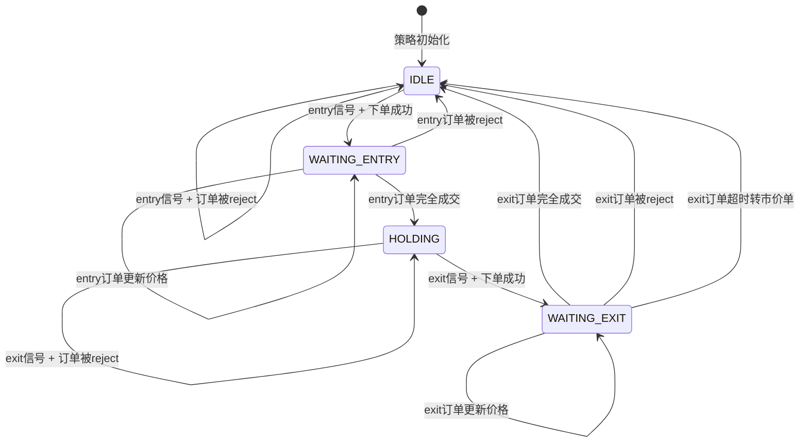
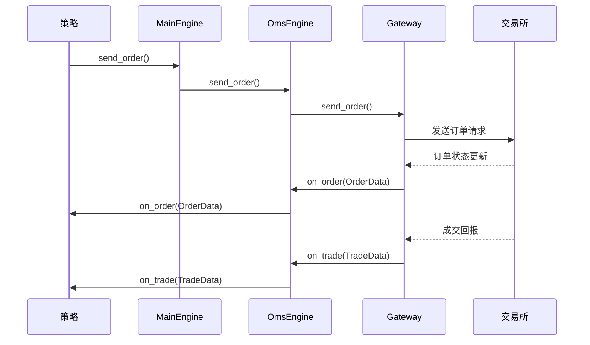

# VWAP Failure 策略 Step2 设计文档 - 完全基于 Context

## 概述

Step2 实现 vwap_failure 策略在 entry 订单交易成功后的逻辑，完全基于 Context 状态机管理，抛弃现有的订单管理和交易次数管理实现。

## 1. 状态机设计

### 1.1 策略状态定义

```python
from enum import Enum

class StrategyState(Enum):
    IDLE = "idle"                    # 空闲状态，等待 entry 信号
    WAITING_ENTRY = "waiting_entry"  # 等待 entry 订单成交
    HOLDING = "holding"              # 持仓中，等待 exit 信号
    WAITING_EXIT = "waiting_exit"    # 等待 exit 订单成交
```

### 1.2 状态迁移图



### 1.3 Context 数据结构

```python
from dataclasses import dataclass
from datetime import datetime, timedelta
from typing import Optional

@dataclass
class StockContext:
    symbol: str
    state: StrategyState = StrategyState.IDLE
    trade_count: int = 0                    # 直接保存交易次数
    entry_order_id: str = ""
    exit_order_id: str = ""
    entry_price: float = 0.0
    entry_time: datetime = None
    exit_start_time: datetime = None
    max_exit_wait_time: timedelta = timedelta(minutes=5)
    position_size: int = 100                # 固定持仓数量
```

## 2. 订单状态变化流程

### 2.1 整体架构流程



### 2.2 各组件职责

#### Gateway（网关）
- 负责与交易所的实际通信
- 接收交易所的订单状态更新和成交回报
- 通过 `on_order()` 和 `on_trade()` 回调向上层推送事件

#### OmsEngine（订单管理系统）
- 维护所有订单、成交、持仓的缓存
- 接收 Gateway 推送的事件，更新内部缓存
- 将事件转发给策略引擎
- 管理 `active_orders` 字典，跟踪活跃订单

#### MainEngine（主引擎）
- 协调各个引擎之间的通信
- 提供统一的接口给策略使用

## 3. 实现步骤

### 3.1 第一步：在 IntradayStrategyBase 中实现 Context 管理

```python
class IntradayStrategyBase:
    """日内策略基础框架 - 集成技术指标和K线生成"""
    
    def __init__(self, use_mock_gateway=False):
        """初始化日内策略基础框架"""
        # 现有的初始化代码...
        self.use_mock_gateway = use_mock_gateway
        self.event_engine = None
        self.main_engine = None
        self.gateway = None
        self.gateway_name = None
        self.brisk_gateway = None
        self.bar_generators = {}
        self.indicator_managers = {}
        self.bars_count = defaultdict(int)
        
        # 新增：Context 管理
        self.contexts: Dict[str, StockContext] = {}
        
    def get_context(self, symbol: str) -> StockContext:
        """获取或创建股票 Context"""
        if symbol not in self.contexts:
            self.contexts[symbol] = StockContext(symbol=symbol)
        return self.contexts[symbol]
    
    def update_context_state(self, symbol: str, new_state: StrategyState):
        """更新 Context 状态"""
        context = self.get_context(symbol)
        old_state = context.state
        context.state = new_state
        self.write_log(f"Context state changed for {symbol}: {old_state} -> {new_state}")
    
    def get_context_by_order_id(self, order_id: str) -> Optional[StockContext]:
        """根据订单ID查找对应的 Context"""
        for context in self.contexts.values():
            if context.entry_order_id == order_id or context.exit_order_id == order_id:
                return context
        return None
    
    def write_log(self, msg: str):
        """写日志"""
        print(f"[{self.__class__.__name__}] {msg}")

class VWAPFailureStrategy(IntradayStrategyBase):
    """继承 IntradayStrategyBase 的 VWAP Failure 策略"""
    
    def __init__(self, use_mock_gateway=True):
        super().__init__(use_mock_gateway=use_mock_gateway)
        
        # 策略参数
        self.market_cap_threshold = 100_000_000_000
        self.gap_up_threshold = 0.02
        self.gap_down_threshold = -0.02
        self.failure_threshold = 3
        self.entry_factor = 1.5
        self.max_daily_trades = 3
        self.latest_entry_time = "14:30:00"
        
        # 股票状态管理
        self.stock_master = {}
        self.market_cap_eligible = set()
        self.eligible_stocks = set()
        self.first_tick_prices = {}
        self.gap_direction = {}
        self.trading_date = None
        
        # 信号统计
        self.signal_count = 0
        self.signals = []
        
        # 订单相关参数
        self.exit_factor = 1.0
        self.max_exit_wait_time = 30
```

### 3.2 第二步：完全基于 Context 的订单管理

```python
def on_order(self, order: OrderData):
    """订单状态变化回调"""
    context = self.get_context_by_order_id(order.vt_orderid)
    if not context:
        return
    
    if order.vt_orderid == context.entry_order_id:
        self._handle_entry_order_update(order, context)
    elif order.vt_orderid == context.exit_order_id:
        self._handle_exit_order_update(order, context)

def on_trade(self, trade: TradeData):
    """成交回调"""
    context = self.get_context_by_order_id(trade.vt_orderid)
    if not context:
        return
    
    if trade.vt_orderid == context.entry_order_id:
        self._handle_entry_trade(trade, context)
    elif trade.vt_orderid == context.exit_order_id:
        self._handle_exit_trade(trade, context)

def on_1min_bar(self, bar):
    """重写1分钟K线处理逻辑"""
    # 只处理真正符合条件的股票
    if bar.symbol not in self.eligible_stocks:
        return
        
    # 调用父类方法更新技术指标
    super().on_1min_bar(bar)
    
    # 获取技术指标
    indicators = self.get_indicators(bar.symbol)
    if not indicators:
        return
    
    # 更新等待中的订单价格（基于 Context）
    self._update_pending_orders(bar, indicators)
    
    # 生成交易信号（基于 Context 状态）
    self._generate_trading_signal(bar, indicators)

def _update_pending_orders(self, bar, indicators):
    """更新等待中的订单价格 - 完全基于 Context"""
    symbol = bar.symbol
    context = self.get_context(symbol)
    
    # 更新 entry 订单
    if context.state == StrategyState.WAITING_ENTRY and context.entry_order_id:
        self._update_entry_order_price(context, bar, indicators)
    
    # 更新 exit 订单
    elif context.state == StrategyState.WAITING_EXIT and context.exit_order_id:
        self._update_exit_order_price(context, bar, indicators)
        self._check_exit_timeout(context)

def _update_entry_order_price(self, context: StockContext, bar: BarData, indicators: dict):
    """更新 entry 订单价格"""
    vwap = indicators['vwap']
    atr = indicators['atr_14']
    
    # 计算新的 entry 价格
    if self._is_gap_up(context.symbol):
        new_entry_price = vwap + (atr * self.entry_factor)  # 做空
    else:
        new_entry_price = vwap - (atr * self.entry_factor)  # 做多
    
    # 撤单并重新下单
    self.cancel_order(context.entry_order_id)
    order_ids = self.buy(context.symbol, new_entry_price, context.position_size)
    if order_ids:
        context.entry_order_id = order_ids[0]

def _update_exit_order_price(self, context: StockContext, bar: BarData, indicators: dict):
    """更新 exit 订单价格"""
    vwap = indicators['vwap']
    atr = indicators['atr_14']
    
    # 计算新的 exit 价格
    if self._is_gap_up(context.symbol):
        new_exit_price = vwap - (atr * self.exit_factor)  # 做空平仓
    else:
        new_exit_price = vwap + (atr * self.exit_factor)  # 做多平仓
    
    # 撤单并重新下单
    self.cancel_order(context.exit_order_id)
    
    # 根据 gap 方向决定平仓方式
    if self._is_gap_up(context.symbol):
        # Gap Up 策略是做空，平仓需要买入
        order_ids = self.buy(context.symbol, new_exit_price, context.position_size)
    else:
        # Gap Down 策略是做多，平仓需要卖出
        order_ids = self.sell(context.symbol, new_exit_price, context.position_size)
    
    if order_ids:
        context.exit_order_id = order_ids[0]

def _handle_entry_order_update(self, order: OrderData, context: StockContext):
    """处理 entry 订单状态更新"""
    if order.status == Status.REJECTED:
        # entry 订单被拒绝，重置状态
        self.update_context_state(context.symbol, StrategyState.IDLE)
        context.entry_order_id = ""
        self.write_log(f"Entry order rejected for {context.symbol}")
        
    elif order.status == Status.ALLTRADED:
        # entry 订单完全成交，进入持仓状态
        self.update_context_state(context.symbol, StrategyState.HOLDING)
        context.entry_price = order.price
        context.entry_time = order.datetime
        self._generate_exit_signal(context)

def _handle_entry_trade(self, trade: TradeData, context: StockContext):
    """处理 entry 成交"""
    # 更新成交信息
    context.entry_price = trade.price
    context.entry_time = trade.datetime
    self.write_log(f"Entry trade executed for {context.symbol}: {trade.volume} @ {trade.price}")
    
    # 状态迁移到 HOLDING
    self.update_context_state(context.symbol, StrategyState.HOLDING)
    
    # 生成 exit 订单
    self._generate_exit_order(context, trade)

def _handle_exit_order_update(self, order: OrderData, context: StockContext):
    """处理 exit 订单状态更新"""
    if order.status == Status.REJECTED:
        # exit 订单被拒绝，回到 HOLDING 状态
        self.update_context_state(context.symbol, StrategyState.HOLDING)
        context.exit_order_id = ""
        self.write_log(f"Exit order rejected for {context.symbol}")
        
    elif order.status == Status.ALLTRADED:
        # exit 订单完全成交，交易完成，增加交易次数
        context.trade_count += 1
        self.update_context_state(context.symbol, StrategyState.IDLE)
        context.exit_order_id = ""
        self.write_log(f"Trade completed for {context.symbol}, count: {context.trade_count}")

def _handle_exit_trade(self, trade: TradeData, context: StockContext):
    """处理 exit 成交"""
    # 更新成交信息
    self.write_log(f"Exit trade executed for {context.symbol}: {trade.volume} @ {trade.price}")
    
    # 状态迁移到 IDLE
    self.update_context_state(context.symbol, StrategyState.IDLE)
    context.exit_order_id = ""

def _generate_exit_order(self, context: StockContext, entry_trade: TradeData):
    """生成 exit 订单"""
    # 计算 exit 价格
    if self._is_gap_up(context.symbol):
        exit_price = context.entry_price - (self.exit_factor * 0.01)  # 做空平仓
    else:
        exit_price = context.entry_price + (self.exit_factor * 0.01)  # 做多平仓
    
    # 根据 gap 方向决定平仓方式
    if self._is_gap_up(context.symbol):
        # Gap Up 策略是做空，平仓需要买入
        order_ids = self.buy(context.symbol, exit_price, context.position_size)
    else:
        # Gap Down 策略是做多，平仓需要卖出
        order_ids = self.sell(context.symbol, exit_price, context.position_size)
    
    if order_ids:
        context.exit_order_id = order_ids[0]
        context.exit_start_time = datetime.now()
        self.update_context_state(context.symbol, StrategyState.WAITING_EXIT)

def _check_exit_timeout(self, context: StockContext):
    """检查 exit 订单是否超时"""
    if (datetime.now() - context.exit_start_time) > context.max_exit_wait_time:
        # 超时，撤单并以市价单平仓
        self.cancel_order(context.exit_order_id)
        
        # 根据 gap 方向决定平仓方式
        if self._is_gap_up(context.symbol):
            # Gap Up 策略是做空，平仓需要买入
            order_ids = self.buy(context.symbol, 0, context.position_size)  # 市价单
        else:
            # Gap Down 策略是做多，平仓需要卖出
            order_ids = self.sell(context.symbol, 0, context.position_size)  # 市价单
        
        if order_ids:
            context.exit_order_id = order_ids[0]
        self.write_log(f"Exit order timeout for {context.symbol}, switching to market order")

def _generate_trading_signal(self, bar, indicators):
    """生成交易信号 - 基于 Context 状态"""
    # 检查交易时间限制
    if not self._is_within_trading_time(bar.datetime):
        return
    
    # 获取 Context
    context = self.get_context(bar.symbol)
    
    # 检查交易次数限制 - 直接使用 Context 中的交易次数
    if context.trade_count >= self.max_daily_trades:
        return
    
    # 检查当前状态
    if context.state != StrategyState.IDLE:
        return
    
    # 检查 gap 条件
    gap_dir = self.gap_direction.get(bar.symbol, 'none')
    if gap_dir == 'none':
        return
    
    vwap = indicators['vwap']
    atr = indicators['atr_14']
    
    if gap_dir == 'up':
        # Gap Up策略：寻找VWAP failure做空机会
        below_vwap_count = indicators['below_vwap_count']
        
        if below_vwap_count >= self.failure_threshold:
            # 在VWAP + ATR * entry_factor位置做空
            short_price = vwap + (atr * self.entry_factor)
            self._execute_short_entry(context, bar, short_price, atr, vwap, below_vwap_count)
            
    elif gap_dir == 'down':
        # Gap Down策略：寻找VWAP failure做多机会
        above_vwap_count = indicators['above_vwap_count']
        
        if above_vwap_count >= self.failure_threshold:
            # 在VWAP - ATR * entry_factor位置做多
            long_price = vwap - (atr * self.entry_factor)
            self._execute_long_entry(context, bar, long_price, atr, vwap, above_vwap_count)

def _execute_short_entry(self, context: StockContext, bar, price, atr, vwap, failure_count):
    """执行做空开仓"""
    print(f"执行做空开仓: {bar.symbol} 价格: {price:.2f} VWAP: {vwap:.2f} "
          f"ATR: {atr:.2f} Failure次数: {failure_count} "
          f"时间: {bar.datetime.strftime('%H:%M:%S')}")
    
    # 创建OrderRequest
    order_req = OrderRequest(
        symbol=bar.symbol,
        exchange=bar.exchange,
        direction=Direction.SHORT,
        type=OrderType.LIMIT,
        volume=context.position_size,
        price=price,
        offset=Offset.OPEN,
        reference=f"entry_short_{bar.symbol}_{bar.datetime.strftime('%H%M%S')}"
    )
    
    # 执行下单
    order_id = self.gateway.send_order(order_req)
    
    if order_id:
        print(f"做空开仓订单已提交: {bar.symbol} 订单ID: {order_id}")
        context.entry_order_id = order_id
        self.update_context_state(bar.symbol, StrategyState.WAITING_ENTRY)
    else:
        print(f"做空开仓订单被拒绝: {bar.symbol}")

def _execute_long_entry(self, context: StockContext, bar, price, atr, vwap, failure_count):
    """执行做多开仓"""
    print(f"执行做多开仓: {bar.symbol} 价格: {price:.2f} VWAP: {vwap:.2f} "
          f"ATR: {atr:.2f} Failure次数: {failure_count} "
          f"时间: {bar.datetime.strftime('%H:%M:%S')}")
    
    # 创建OrderRequest
    order_req = OrderRequest(
        symbol=bar.symbol,
        exchange=bar.exchange,
        direction=Direction.LONG,
        type=OrderType.LIMIT,
        volume=context.position_size,
        price=price,
        offset=Offset.OPEN,
        reference=f"entry_long_{bar.symbol}_{bar.datetime.strftime('%H%M%S')}"
    )
    
    # 执行下单
    order_id = self.gateway.send_order(order_req)
    
    if order_id:
        print(f"做多开仓订单已提交: {bar.symbol} 订单ID: {order_id}")
        context.entry_order_id = order_id
        self.update_context_state(bar.symbol, StrategyState.WAITING_ENTRY)
    else:
        print(f"做多开仓订单被拒绝: {bar.symbol}")

def _is_within_trading_time(self, bar_datetime):
    """检查是否在允许交易的时间范围内"""
    current_time = bar_datetime.time()
    latest_time = datetime.strptime(self.latest_entry_time, "%H:%M:%S").time()
    return current_time <= latest_time

def _is_gap_up(self, symbol: str) -> bool:
    """判断是否为 gap up"""
    return self.gap_direction.get(symbol, 'none') == 'up'
```

### 3.3 第三步：实现 Entry 订单管理

```python
def _handle_entry_order_update(self, order: OrderData, context: StockContext):
    """处理 entry 订单状态更新"""
    if order.status == Status.REJECTED:
        # entry 订单被拒绝，重置状态
        self.update_context_state(context.symbol, StrategyState.IDLE)
        context.entry_order_id = ""
        self.write_log(f"Entry order rejected for {context.symbol}")
        
    elif order.status == Status.ALLTRADED:
        # entry 订单完全成交，进入持仓状态
        self.update_context_state(context.symbol, StrategyState.HOLDING)
        context.entry_price = order.price
        context.entry_time = order.datetime
        self._generate_exit_signal(context)

def _handle_entry_trade(self, trade: TradeData, context: StockContext):
    """处理 entry 成交"""
    # 更新成交信息
    context.entry_price = trade.price
    context.entry_time = trade.datetime
    self.write_log(f"Entry trade executed for {context.symbol}: {trade.volume} @ {trade.price}")
    
    # 状态迁移到 HOLDING
    self.update_context_state(context.symbol, StrategyState.HOLDING)
    
    # 生成 exit 订单
    self._generate_exit_order(context, trade)

def _generate_exit_signal(self, context: StockContext):
    """生成 exit 信号"""
    # 获取当前 bar 数据和技术指标
    current_bar = self.get_bar_data(context.symbol)
    if not current_bar:
        return
    
    # 使用现有的技术指标计算逻辑
    vwap = self._get_vwap(context.symbol, current_bar)
    atr = self._get_atr(context.symbol, current_bar)
    
    # 根据 gap up/down 确定 exit 价格
    if self._is_gap_up(context.symbol):
        exit_price = vwap - self.exit_factor * atr
    else:
        exit_price = vwap + self.exit_factor * atr
    
    # 根据持仓方向决定平仓方式
    position = self.get_position(context.symbol)
    if position > 0:  # 多头持仓，需要卖出平仓
        order_ids = self.sell(context.symbol, exit_price, abs(position))
    else:  # 空头持仓，需要买入平仓
        order_ids = self.buy(context.symbol, exit_price, abs(position))
    
    if order_ids:
        context.exit_order_id = order_ids[0]
        context.exit_start_time = datetime.now()
        self.update_context_state(context.symbol, StrategyState.WAITING_EXIT)

def _handle_exit_order_update(self, order: OrderData, context: StockContext):
    """处理 exit 订单状态更新"""
    if order.status == Status.REJECTED:
        # exit 订单被拒绝（理论上不应该发生）
        self.write_log(f"WARNING: Exit order rejected for {context.symbol}")
        self.update_context_state(context.symbol, StrategyState.IDLE)
        context.exit_order_id = ""
        
    elif order.status == Status.ALLTRADED:
        # exit 订单完全成交，交易完成
        context.trade_count += 1
        self.update_context_state(context.symbol, StrategyState.IDLE)
        context.exit_order_id = ""
        self.write_log(f"Trade completed for {context.symbol}, count: {context.trade_count}")

def _handle_exit_trade(self, trade: TradeData, context: StockContext):
    """处理 exit 成交"""
    # 更新成交信息
    self.write_log(f"Exit trade executed for {context.symbol}: {trade.volume} @ {trade.price}")
    
    # 状态迁移到 IDLE
    self.update_context_state(context.symbol, StrategyState.IDLE)
    context.exit_order_id = ""
```

### 3.4 第四步：实现动态价格更新

**调用时机说明：**
`_update_pending_orders` 方法在 `on_1min_bar` 回调中被调用，这与现有的实现保持一致。
每个新的 1分钟 bar 到来时，都会触发订单价格的更新，确保订单价格与最新的市场数据同步。

```python
def _check_exit_timeout(self, context: StockContext):
    """检查 exit 订单是否超时"""
    if (datetime.now() - context.exit_start_time) > context.max_exit_wait_time:
        # 超时，撤单并以市价单平仓
        self.cancel_order(context.exit_order_id)
        
        # 根据 gap 方向决定平仓方式
        if self._is_gap_up(context.symbol):
            # Gap Up 策略是做空，平仓需要买入
            order_ids = self.buy(context.symbol, 0, context.position_size)  # 市价单
        else:
            # Gap Down 策略是做多，平仓需要卖出
            order_ids = self.sell(context.symbol, 0, context.position_size)  # 市价单
        
        if order_ids:
            context.exit_order_id = order_ids[0]
        self.write_log(f"Exit order timeout for {context.symbol}, switching to market order")
```

### 3.5 第五步：实现交易次数限制

```python
def _should_generate_entry_signal(self, symbol: str) -> bool:
    """判断是否应该生成 entry 信号 - 与现有逻辑兼容"""
    # 使用现有的交易次数管理
    return self.daily_trade_counts[symbol] < self.max_daily_trades
```

### 3.6 第六步：技术指标接口设计

```python
def _get_vwap(self, symbol: str, bar: BarData) -> float:
    """获取 VWAP 值 - 从现有的技术指标计算中获取"""
    # 这里应该调用现有的 VWAP 计算逻辑
    # 例如：return self.vwap_calculator.get_vwap(symbol, bar)
    # 或者：return self.technical_indicators.get_vwap(symbol)
    pass

def _get_atr(self, symbol: str, bar: BarData) -> float:
    """获取 ATR 值 - 从现有的技术指标计算中获取"""
    # 这里应该调用现有的 ATR 计算逻辑
    # 例如：return self.atr_calculator.get_atr(symbol, bar)
    # 或者：return self.technical_indicators.get_atr(symbol)
    pass

def _is_gap_up(self, symbol: str) -> bool:
    """判断是否为 gap up - 从现有的逻辑中获取"""
    # 这里应该调用现有的 gap 判断逻辑
    # 例如：return self.gap_analyzer.is_gap_up(symbol)
    pass

def _calculate_entry_price(self, symbol: str, bar: BarData) -> float:
    """计算 entry 价格 - 从现有的逻辑中获取"""
    # 这里应该调用现有的 entry 价格计算逻辑
    # 例如：return self.entry_calculator.calculate_price(symbol, bar)
    pass

def _calculate_exit_price(self, symbol: str, bar: BarData) -> float:
    """计算 exit 价格 - 从现有的逻辑中获取"""
    # 这里应该调用现有的 exit 价格计算逻辑
    # 例如：return self.exit_calculator.calculate_price(symbol, bar)
    pass

def get_bar_data(self, symbol: str) -> Optional[BarData]:
    """获取当前 bar 数据"""
    # 这里应该从现有的数据管理器中获取
    # 例如：return self.data_manager.get_current_bar(symbol)
    pass

def get_position(self, symbol: str) -> float:
    """获取当前持仓"""
    # 这里应该从现有的持仓管理器中获取
    # 例如：return self.position_manager.get_position(symbol)
    pass
```

### 3.7 新交易日的 Context 重置

```python
def _check_new_trading_day(self, datetime_obj):
    """检查是否是新交易日，如果是则重置相关数据"""
    current_date = datetime_obj.date()
    
    if self.trading_date != current_date:
        print(f"新交易日开始: {current_date}")
        self.trading_date = current_date
        
        # 重置所有 Context
        for context in self.contexts.values():
            context.state = StrategyState.IDLE
            context.trade_count = 0  # 直接重置交易次数
            context.entry_order_id = ""
            context.exit_order_id = ""
            context.entry_price = 0.0
            context.entry_time = None
            context.exit_start_time = None
        
        # 重置其他状态
        self.first_tick_prices.clear()
        self.gap_direction.clear()
        self.eligible_stocks.clear()
        
        # 重置信号统计
        self.signal_count = 0
        self.signals.clear()

def _evaluate_gap_condition(self, symbol):
    """评估gap条件"""
    if symbol not in self.first_tick_prices:
        return
    
    first_price = self.first_tick_prices[symbol]
    prev_close = self.stock_master[symbol].get('prev_close', first_price)
    
    if prev_close > 0:
        gap_ratio = (first_price - prev_close) / prev_close
        
        if gap_ratio >= self.gap_up_threshold:
            self.gap_direction[symbol] = 'up'
            self.eligible_stocks.add(symbol)
            print(f"股票 {symbol} 满足 Gap Up 条件: {gap_ratio:.2%}")
        elif gap_ratio <= self.gap_down_threshold:
            self.gap_direction[symbol] = 'down'
            self.eligible_stocks.add(symbol)
            print(f"股票 {symbol} 满足 Gap Down 条件: {gap_ratio:.2%}")
        else:
            self.gap_direction[symbol] = 'none'
```

### 3.8 Context 状态监控和调试

```python
def print_context_status(self):
    """打印所有 Context 状态"""
    print(f"\n=== Context 状态监控 ===")
    for symbol, context in self.contexts.items():
        if symbol in self.eligible_stocks:
            print(f"{symbol}: {context.state.value} | "
                  f"交易次数: {context.trade_count}/{self.max_daily_trades} | "
                  f"Entry订单: {context.entry_order_id[:8] if context.entry_order_id else 'None'} | "
                  f"Exit订单: {context.exit_order_id[:8] if context.exit_order_id else 'None'}")

def get_context_summary(self) -> dict:
    """获取 Context 汇总信息"""
    summary = {
        'total_contexts': len(self.contexts),
        'eligible_stocks': len(self.eligible_stocks),
        'idle_count': 0,
        'waiting_entry_count': 0,
        'holding_count': 0,
        'waiting_exit_count': 0,
        'total_trades': 0
    }
    
    for context in self.contexts.values():
        summary[f'{context.state.value}_count'] += 1
        summary['total_trades'] += context.trade_count
    
    return summary
```

## 4. Mock Gateway 扩展

### 4.1 需要扩展的功能

```python
class MockBriskGateway(BaseGateway):
    def cancel_order(self, req: CancelRequest) -> None:
        """撤单功能"""
        # 实现撤单逻辑
        
    def query_order(self, req: OrderRequest) -> None:
        """查询订单状态"""
        # 实现订单查询逻辑
        
    def simulate_order_timeout(self, vt_orderid: str, timeout_seconds: int):
        """模拟订单超时"""
        # 实现订单超时模拟
```

### 4.2 测试场景设计

1. **正常流程测试**
   - entry 订单正常成交 → exit 订单正常成交

2. **异常流程测试**
   - entry 订单被 reject
   - exit 订单被 reject
   - exit 订单超时转市价单

3. **价格更新测试**
   - entry 订单价格动态更新
   - exit 订单价格动态更新

4. **交易次数限制测试**
   - 达到最大交易次数后不再生成信号

## 5. 测试用例设计

### 5.1 单元测试

```python
def test_entry_order_rejection():
    """测试 entry 订单被拒绝的情况"""
    
def test_exit_order_timeout():
    """测试 exit 订单超时转市价单"""
    
def test_dynamic_price_update():
    """测试动态价格更新"""
    
def test_trade_count_limit():
    """测试交易次数限制"""
```

### 5.2 集成测试

```python
def test_complete_trading_cycle():
    """测试完整的交易周期"""
    
def test_multiple_symbols():
    """测试多股票并发交易"""
```

## 6. 配置参数

```python
class VwapFailureStrategy:
    # 策略参数
    exit_factor: float = 1.0              # exit 价格因子
    max_daily_trades: int = 3             # 每日最大交易次数
    max_exit_wait_minutes: int = 5        # exit 订单最大等待时间（分钟）
    position_size: int = 100              # 每次交易数量
```

## 7. 日志和监控

### 7.1 关键日志点

- entry 信号生成
- entry 订单状态变化
- exit 信号生成
- exit 订单状态变化
- 交易完成
- 异常情况（订单被拒绝、超时等）

### 7.2 性能监控

- 订单响应时间
- 成交率统计
- 交易次数统计
- 异常情况统计

## 8. 后续优化方向

1. **风险控制**
   - 添加止损机制
   - 添加最大回撤控制

2. **性能优化**
   - 批量订单处理
   - 缓存优化

3. **监控告警**
   - 实时监控面板
   - 异常告警机制

4. **回测验证**
   - 历史数据回测
   - 策略表现分析

## 9. 修正总结

### 9.1 主要修正内容

#### 1. **完全抛弃现有实现**
- **抛弃**：`self.entry_orders` 和 `self.exit_orders` 字典
- **抛弃**：`self.daily_trade_counts` 字典
- **采用**：完全基于 Context 的状态机和数据管理

#### 2. **交易次数管理简化**
- **直接使用**：`context.trade_count` 字段保存交易次数
- **增加时机**：在 `_handle_exit_order_update` 中，当 exit 订单完全成交时增加
- **检查时机**：在 `_generate_trading_signal` 中直接检查 `context.trade_count`
- **优势**：更简洁的数据管理，不需要同步多个数据源

#### 3. **平仓方向判断优化**
- **移除依赖**：不再使用 `get_position()` 函数
- **采用方式**：使用 `_is_gap_up()` 判断平仓方向
- **逻辑清晰**：
  - Gap Up 策略：做空 → 平仓需要买入 (`self.buy()`)
  - Gap Down 策略：做多 → 平仓需要卖出 (`self.sell()`)
- **优势**：逻辑更清晰，不依赖外部持仓查询

#### 4. **Context 数据结构优化**
```python
@dataclass
class StockContext:
    symbol: str
    state: StrategyState = StrategyState.IDLE
    trade_count: int = 0                    # 直接保存交易次数
    entry_order_id: str = ""
    exit_order_id: str = ""
    entry_price: float = 0.0
    entry_time: datetime = None
    exit_start_time: datetime = None
    max_exit_wait_time: timedelta = timedelta(minutes=5)
    position_size: int = 100                # 固定持仓数量
```

#### 5. **订单管理流程优化**
```python
# Entry 成交处理
def _handle_entry_trade(self, trade, context):
    context.entry_price = trade.price
    context.entry_time = trade.datetime
    self.update_context_state(context.symbol, StrategyState.HOLDING)
    self._generate_exit_order(context, trade)  # 直接生成 exit 订单

# Exit 订单完成处理
def _handle_exit_order_update(self, order, context):
    if order.status == Status.ALLTRADED:
        context.trade_count += 1  # 直接增加交易次数
        self.update_context_state(context.symbol, StrategyState.IDLE)
```

#### 6. **平仓逻辑简化**
```python
# 根据 gap 方向决定平仓方式
if self._is_gap_up(context.symbol):
    # Gap Up 策略是做空，平仓需要买入
    order_ids = self.buy(context.symbol, exit_price, context.position_size)
else:
    # Gap Down 策略是做多，平仓需要卖出
    order_ids = self.sell(context.symbol, exit_price, context.position_size)
```

#### 7. **新交易日重置优化**
```python
def _check_new_trading_day(self, datetime_obj):
    # 重置所有 Context
    for context in self.contexts.values():
        context.state = StrategyState.IDLE
        context.trade_count = 0  # 直接重置交易次数
        context.entry_order_id = ""
        context.exit_order_id = ""
        # ... 其他重置
```

#### 8. **状态机设计保持**
- 保持清晰的状态转换逻辑
- 保持统一的 Context 管理
- 保持模块化的设计架构

### 9.2 新设计的核心优势

#### **数据管理简化**
- 单一数据源：所有状态都保存在 Context 中
- 无同步问题：不需要在多个数据源之间同步
- 清晰的数据流：数据流向更加明确

#### **逻辑更清晰**
- 平仓方向判断：基于策略逻辑（gap 方向）而不是持仓查询
- 交易次数管理：在正确的时机（exit 成交）增加计数
- 状态转换：每个状态转换都有明确的触发条件

#### **代码更简洁**
- 移除冗余的同步逻辑
- 移除对不存在函数的依赖
- 统一的数据管理方式

#### **更好的可维护性**
- 每个 Context 独立管理自己的状态
- 清晰的方法职责划分
- 易于调试和测试

### 9.3 实现要点

#### **关键修改点**
1. **交易次数管理**：在 `_handle_exit_order_update` 中增加 `context.trade_count += 1`
2. **平仓方向判断**：使用 `_is_gap_up()` 替代 `get_position()`
3. **数据重置**：在 `_check_new_trading_day` 中重置 `context.trade_count = 0`
4. **信号生成检查**：在 `_generate_trading_signal` 中检查 `context.trade_count >= self.max_daily_trades`

#### **测试重点**
1. **交易次数管理**：验证在 exit 成交时正确增加计数
2. **平仓方向**：验证 gap up/down 策略的平仓方向正确
3. **新交易日重置**：验证交易次数在新交易日正确重置
4. **状态转换**：验证所有状态转换逻辑正确

这个优化后的设计更加简洁、清晰，完全基于 Context 进行状态管理，避免了数据同步问题，提供了更好的可维护性。 