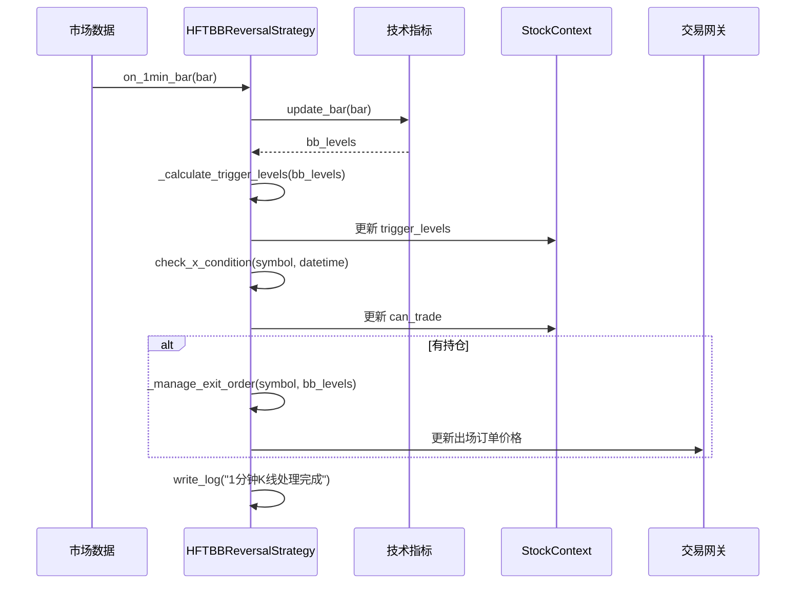
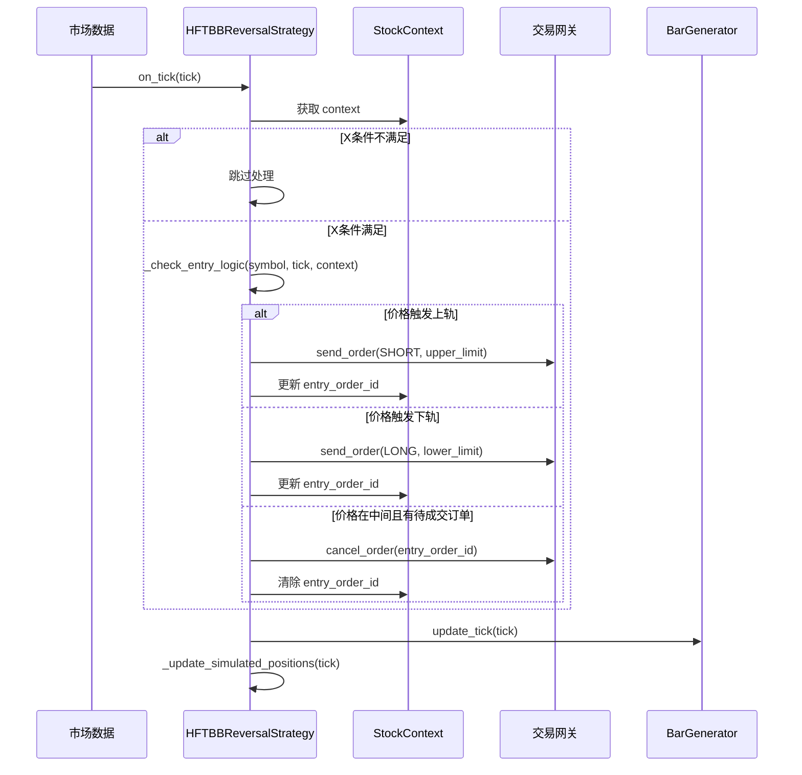
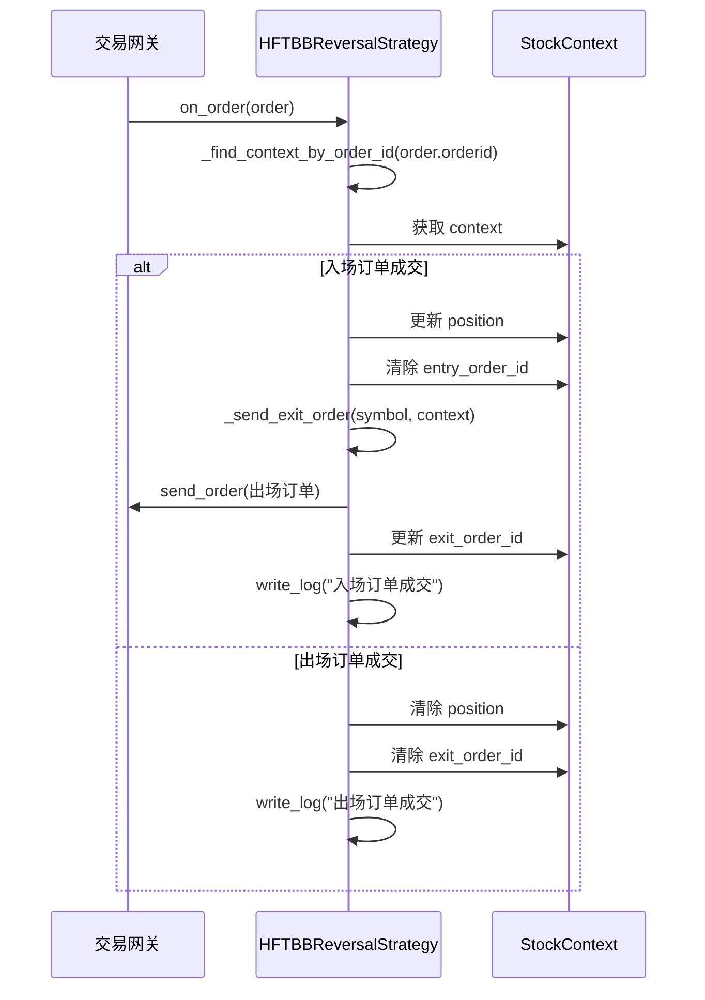
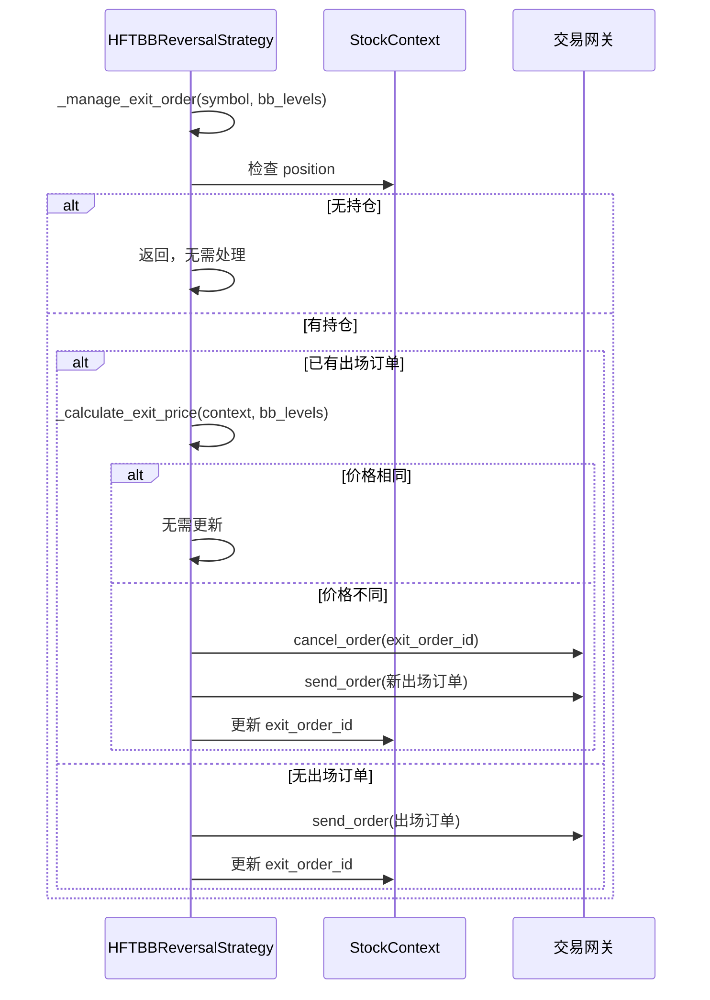
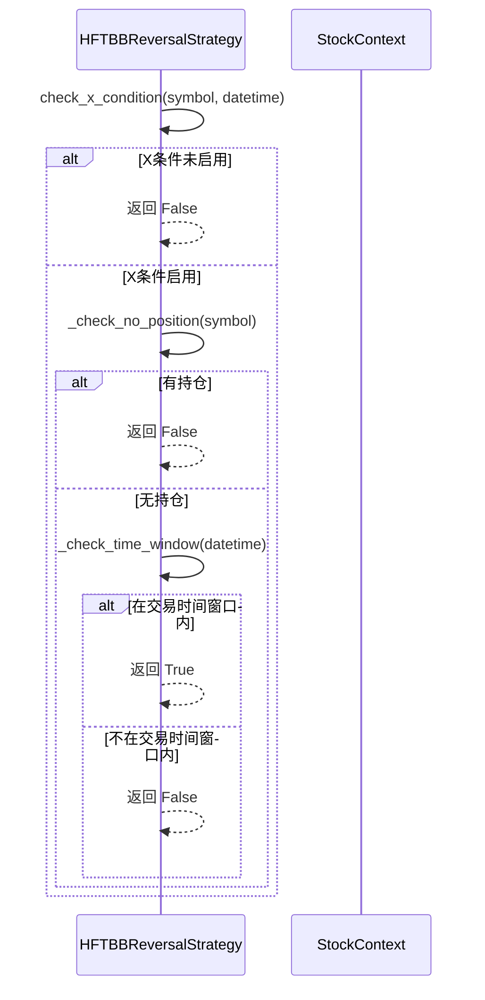
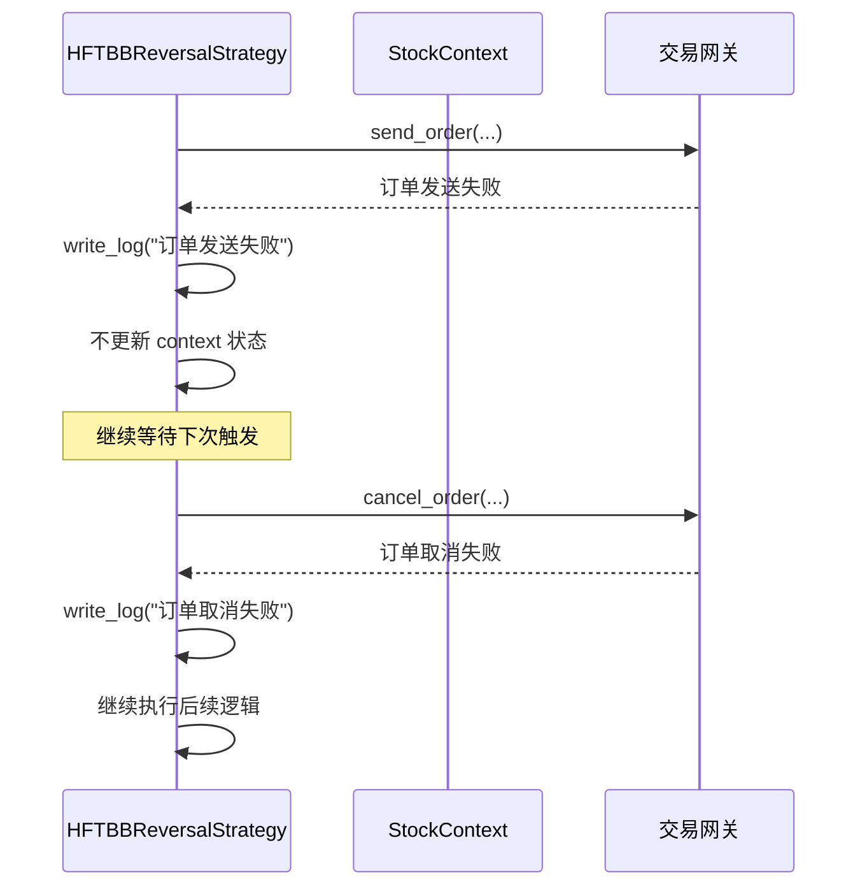
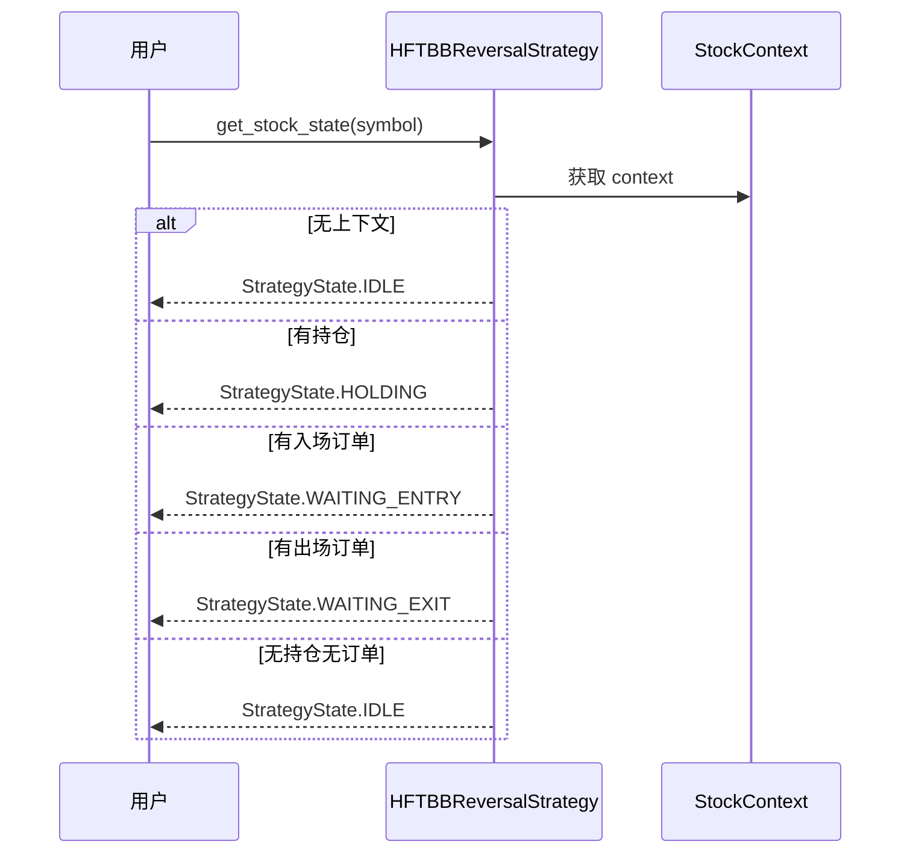

# 交互序列图

## 1. 1分钟K线处理流程

```mermaid
sequenceDiagram
    participant Market as 市场数据
    participant Strategy as HFTBBReversalStrategy
    participant Indicator as 技术指标
    participant Context as StockContext
    participant Gateway as 交易网关

    Market->>Strategy: on_1min_bar(bar)
    Strategy->>Indicator: update_bar(bar)
    Indicator-->>Strategy: bb_levels
    
    Strategy->>Strategy: _calculate_trigger_levels(bb_levels)
    Strategy->>Context: 更新 trigger_levels
    
    Strategy->>Strategy: check_x_condition(symbol, datetime)
    Strategy->>Context: 更新 can_trade
    
    alt 有持仓
        Strategy->>Strategy: _manage_exit_order(symbol, bb_levels)
        Strategy->>Gateway: 更新出场订单价格
    end
    
    Strategy->>Strategy: write_log("1分钟K线处理完成")
```

## 2. Tick数据处理流程

```mermaid
sequenceDiagram
    participant Market as 市场数据
    participant Strategy as HFTBBReversalStrategy
    participant Context as StockContext
    participant Gateway as 交易网关
    participant BarGen as BarGenerator

    Market->>Strategy: on_tick(tick)
    Strategy->>Context: 获取 context
    
    alt X条件不满足
        Strategy->>Strategy: 跳过处理
    else X条件满足
        Strategy->>Strategy: _check_entry_logic(symbol, tick, context)
        
        alt 价格触发上轨
            Strategy->>Gateway: send_order(SHORT, upper_limit)
            Strategy->>Context: 更新 entry_order_id
        else 价格触发下轨
            Strategy->>Gateway: send_order(LONG, lower_limit)
            Strategy->>Context: 更新 entry_order_id
        else 价格在中间且有待成交订单
            Strategy->>Gateway: cancel_order(entry_order_id)
            Strategy->>Context: 清除 entry_order_id
        end
    end
    
    Strategy->>BarGen: update_tick(tick)
    Strategy->>Strategy: _update_simulated_positions(tick)
```

## 3. 订单成交处理流程

```mermaid
sequenceDiagram
    participant Gateway as 交易网关
    participant Strategy as HFTBBReversalStrategy
    participant Context as StockContext

    Gateway->>Strategy: on_order(order)
    Strategy->>Strategy: _find_context_by_order_id(order.orderid)
    Strategy->>Context: 获取 context
    
    alt 入场订单成交
        Strategy->>Context: 更新 position
        Strategy->>Context: 清除 entry_order_id
        Strategy->>Strategy: _send_exit_order(symbol, context)
        Strategy->>Gateway: send_order(出场订单)
        Strategy->>Context: 更新 exit_order_id
        Strategy->>Strategy: write_log("入场订单成交")
    else 出场订单成交
        Strategy->>Context: 清除 position
        Strategy->>Context: 清除 exit_order_id
        Strategy->>Strategy: write_log("出场订单成交")
    end
```

## 4. 出场订单管理流程

```mermaid
sequenceDiagram
    participant Strategy as HFTBBReversalStrategy
    participant Context as StockContext
    participant Gateway as 交易网关

    Strategy->>Strategy: _manage_exit_order(symbol, bb_levels)
    Strategy->>Context: 检查 position
    
    alt 无持仓
        Strategy->>Strategy: 返回，无需处理
    else 有持仓
        alt 已有出场订单
            Strategy->>Strategy: _calculate_exit_price(context, bb_levels)
            alt 价格相同
                Strategy->>Strategy: 无需更新
            else 价格不同
                Strategy->>Gateway: cancel_order(exit_order_id)
                Strategy->>Gateway: send_order(新出场订单)
                Strategy->>Context: 更新 exit_order_id
            end
        else 无出场订单
            Strategy->>Gateway: send_order(出场订单)
            Strategy->>Context: 更新 exit_order_id
        end
    end
```

## 5. X条件检查流程

```mermaid
sequenceDiagram
    participant Strategy as HFTBBReversalStrategy
    participant Context as StockContext

    Strategy->>Strategy: check_x_condition(symbol, datetime)
    
    alt X条件未启用
        Strategy-->>Strategy: 返回 False
    else X条件启用
        Strategy->>Strategy: _check_no_position(symbol)
        alt 有持仓
            Strategy-->>Strategy: 返回 False
        else 无持仓
            Strategy->>Strategy: _check_time_window(datetime)
            alt 在交易时间窗口内
                Strategy-->>Strategy: 返回 True
            else 不在交易时间窗口内
                Strategy-->>Strategy: 返回 False
            end
        end
    end
```

## 6. 错误处理流程

```mermaid
sequenceDiagram
    participant Strategy as HFTBBReversalStrategy
    participant Context as StockContext
    participant Gateway as 交易网关

    Strategy->>Gateway: send_order(...)
    Gateway-->>Strategy: 订单发送失败
    
    Strategy->>Strategy: write_log("订单发送失败")
    Strategy->>Strategy: 不更新 context 状态
    
    Note over Strategy: 继续等待下次触发
    
    Strategy->>Gateway: cancel_order(...)
    Gateway-->>Strategy: 订单取消失败
    
    Strategy->>Strategy: write_log("订单取消失败")
    Strategy->>Strategy: 继续执行后续逻辑
```

## 7. 状态查询流程

```mermaid
sequenceDiagram
    participant User as 用户
    participant Strategy as HFTBBReversalStrategy
    participant Context as StockContext

    User->>Strategy: get_stock_state(symbol)
    Strategy->>Context: 获取 context
    
    alt 无上下文
        Strategy-->>User: StrategyState.IDLE
    else 有持仓
        Strategy-->>User: StrategyState.HOLDING
    else 有入场订单
        Strategy-->>User: StrategyState.WAITING_ENTRY
    else 有出场订单
        Strategy-->>User: StrategyState.WAITING_EXIT
    else 无持仓无订单
        Strategy-->>User: StrategyState.IDLE
    end
```