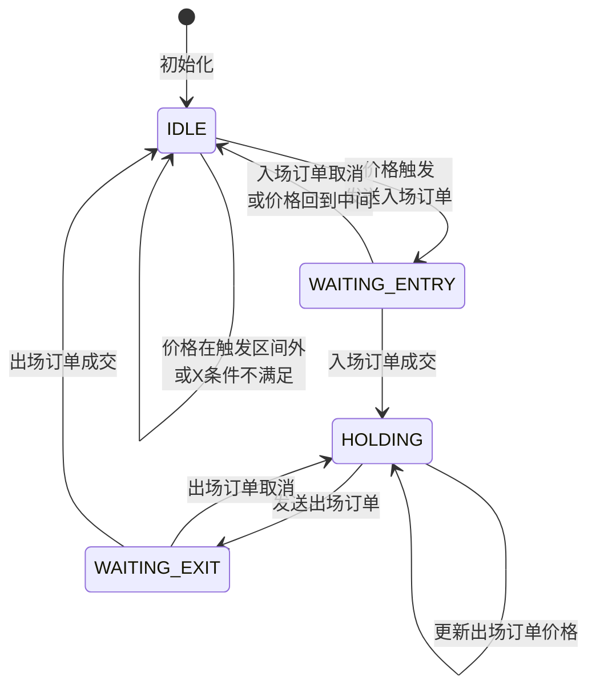

# 状态机设计

## 数据结构

### 1. 触发价格水平 (TriggerLevels)

```python
@dataclass
class TriggerLevels:
    """触发价格水平"""
    upper_trigger: float    # 上轨触发价格
    upper_limit: float      # 上轨限价价格
    lower_trigger: float    # 下轨触发价格
    lower_limit: float      # 下轨限价价格
```

### 2. 股票上下文扩展 (StockContext Extension)

复用 `IntradayStrategyBase` 中已有的 `StockContext`，添加以下字段：

```python
# 在 StockContext 中添加的字段
trigger_levels: Optional[TriggerLevels] = None  # 触发价格水平
can_trade: bool = False                          # X条件满足标志
bb_levels: Optional[dict] = None                 # 布林带水平
```

### 3. 状态定义

直接使用 `IntradayStrategyBase` 中已定义的 `StrategyState` 枚举：

- **IDLE**: 空闲状态，等待 entry 信号
- **WAITING_ENTRY**: 等待 entry 订单成交
- **HOLDING**: 持仓中，等待 exit 信号
- **WAITING_EXIT**: 等待 exit 订单成交
- **WAITING_TIMEOUT_EXIT**: 等待timeout exit limit order

## 状态转换图



## 核心状态管理

### 1. 入场状态管理

```python
def _check_entry_logic(self, symbol: str, tick: TickData, context: StockContext):
    """检查入场逻辑"""
    trigger_levels = context.trigger_levels
    current_price = tick.last_price
    
    # 状态判断逻辑
    if current_price >= trigger_levels.upper_trigger:
        # 触发上轨，发送空头订单
        self._send_entry_order(symbol, Direction.SHORT, trigger_levels.upper_limit)
    elif current_price <= trigger_levels.lower_trigger:
        # 触发下轨，发送多头订单
        self._send_entry_order(symbol, Direction.LONG, trigger_levels.lower_limit)
    elif context.entry_order_id and self._should_cancel_entry_order(context, current_price):
        # 取消现有订单
        self._cancel_entry_order(symbol, context)
```

### 2. 出场状态管理

```python
def _manage_exit_order(self, symbol: str, bb_levels: dict):
    """管理出场订单"""
    context = self.contexts[symbol]
    
    if context.position == 0:
        return  # 无持仓，不需要出场订单
    
    if context.exit_order_id:
        # 检查是否需要更新价格
        new_price = self._calculate_exit_price(context, bb_levels)
        if context.exit_order_price != new_price:
            # 价格变化，更新订单
            self._update_exit_order(symbol, context, new_price)
    else:
        # 创建新的出场订单
        self._send_exit_order(symbol, context, bb_levels)
```

### 3. 订单成交处理

```python
def _handle_entry_filled(self, symbol: str, context: StockContext, order: OrderData):
    """处理入场订单成交"""
    # 更新持仓
    context.position = order.traded_volume if order.direction == Direction.LONG else -order.traded_volume
    
    # 清除入场订单信息
    context.entry_order_id = None
    context.entry_order_price = 0.0
    
    # 立即发送出场订单
    self._send_exit_order(symbol, context, context.bb_levels)

def _handle_exit_filled(self, symbol: str, context: StockContext, order: OrderData):
    """处理出场订单成交"""
    # 清除持仓
    context.position = 0
    context.exit_order_id = None
    context.exit_order_price = 0.0
```

## 复用 Base Strategy 的优势

1. **订单管理复用**：使用 `send_order()`, `cancel_order()` 等已有方法
2. **状态管理复用**：使用 `StockContext` 中已有的 `position`, `entry_order_id`, `exit_order_id` 字段
3. **状态枚举复用**：直接使用 `StrategyState` 枚举，无需重新定义
4. **状态转换复用**：使用 `update_context_state()` 方法进行状态管理
5. **持仓更新复用**：使用 `_update_simulated_positions()` 方法
6. **Bar生成复用**：使用 `BarGenerator` 的 `update_tick()` 方法
7. **日志记录复用**：使用 `write_log()` 方法

## 错误处理

1. **订单发送失败**：记录错误日志，不更新状态
2. **订单取消失败**：记录警告日志，继续执行
3. **数据缺失**：跳过处理，等待下次更新
4. **状态不一致**：通过订单ID查找和验证状态